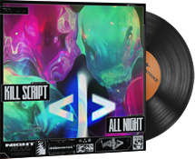
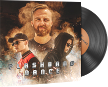
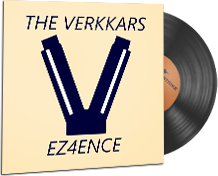

     
    
     

# Counter-Strike 2 (3DS Theme)

 Custom theme for Anemone3DS inspired by Counter-Strike 2. 

### Main preview

 

### Music kits available

 
 
 
 
 
 

## How to download?

 Scan the next QR code with Anemone3DS to download main theme:

 

 Scan the next music kit QR code you want with Anemone3DS:

 **Music Kit, Daniel Sadowski, The 8-Bit Kit**

 

 **Music Kit, ISOxo, inhuman**

 

 **Music Kit, KILL SCRIPT, All Night**

 

 **Music Kit, TWERL and Ekko & Sidetrack, Under Bright Lights**

 

 **Music Kit, The Verkkars & n0thing, Flashbang Dance**

 

 **Music Kit, The Verkkars, EZ4ENCE**

 

## How to use?

 Set main theme as current theme on Anemone3DS.

 Set music kit as music only on Anemone3DS.

 Have fun! 😉

## License and Usage Restrictions

 This project is licensed under a custom license that **prohibits commercial use**.

 For more details, see the [LICENSE](./LICENSE) file.
