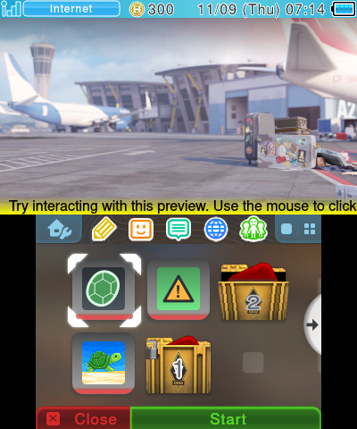
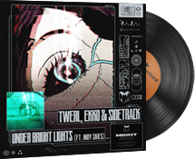
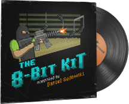
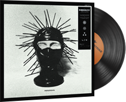

     
    
     
     
    <a href="https://themeplaza.art/profile/TheRake66" target="_blank">
        <b>• View on Theme Plaza •</b>
    </a>
     
     
    <a href="https://github.com/TheRake66/Counter-Strike-2-3DS-Theme/tree/main/deployed_packs" target="_blank">
        <b>• Download here •</b>
    </a>
     
     
    
    
     
     

# Counter-Strike-2 (3DS Theme)

 Custom theme for Anemone3DS inspired by Counter-Strike 2. 

### Main preview

 

### Music kits available

 
 
 
 
 
 

## How to download (on GitHub)?

 Go on  page.

 Download main theme (*Counter-Strike 2.zip*).

 Download music kit you want (ex. *Music Kit, The Verkkars, EZ4ENCE.zip*).

 Transfer files to your 3DS sdcard in `/themes` folder (you can use *FTPD*).

## How to download (on Theme Plaza)?

 Go on  page.

 Scan QR code with Anemone3DS homebrew.

## How to use?

 Set main theme as current theme on Anemone3DS.

 Set music kit as music only on Anemone3DS.

 Have fun! 😉

## License and Usage Restrictions

 This project is licensed under a custom license that **prohibits commercial use**.

 For more details, see the [LICENSE](./LICENSE) file.
